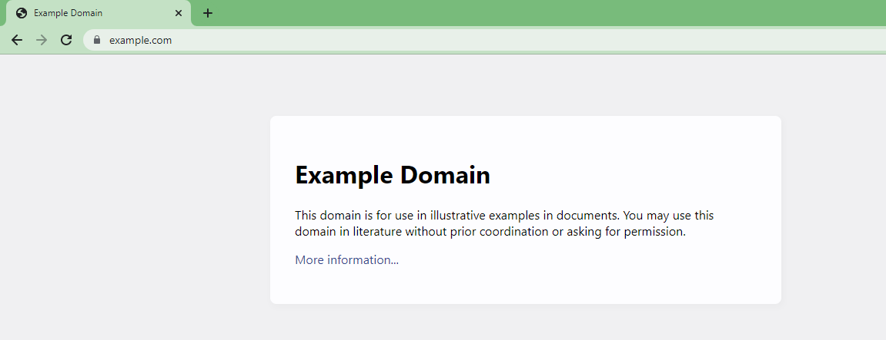
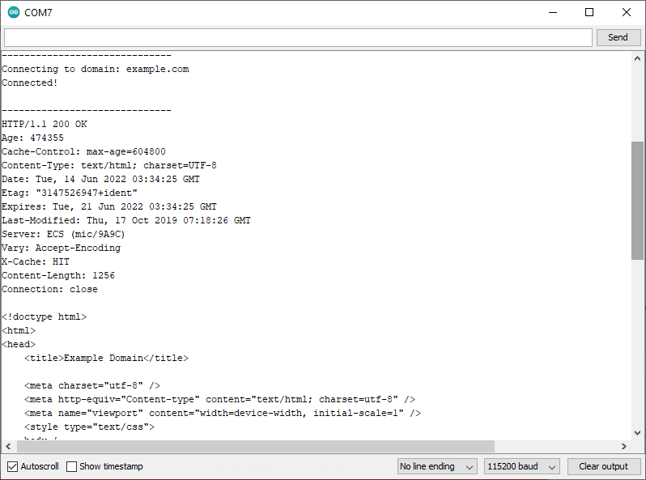
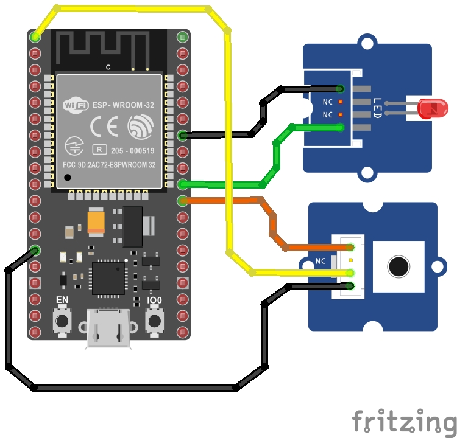
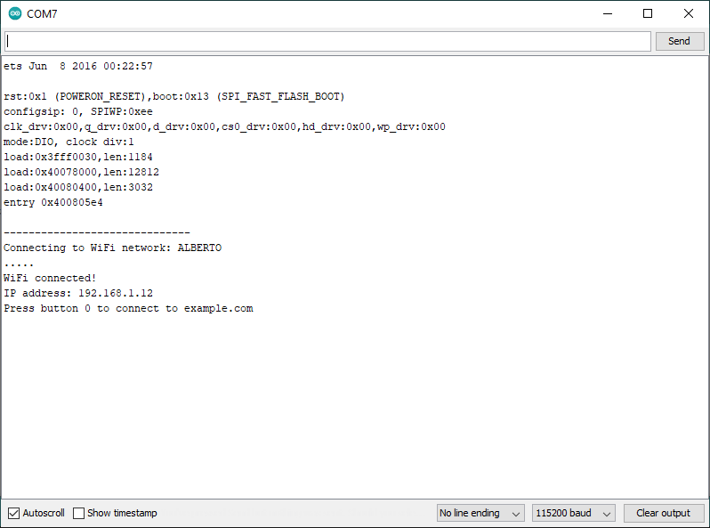

# Ejemplo 1

## Hardware necesario

1. NODEMCU-ESP32 
2. Grove - Button ([link](https://wiki.seeedstudio.com/Grove-Button/))
3. Grove - Red LED ([link](https://wiki.seeedstudio.com/Grove-Red_LED/))

## Descripción

Este ejemplo tomado de **ESP32 Thing Hookup Guide** de Sparkfun ([link](https://learn.sparkfun.com/tutorials/esp32-thing-hookup-guide#arduino-example-wifi)) hace uso de la libreria **WiFi** para demostrar como conectar la placa NodeMCU-ESP32 a una red WiFi determinada y acceder, usando la placa como cliente, a la pagina [http://example.com/](http://example.com/) la cual se muestra a continuación:



El acceso a la pagina [http://example.com/](http://example.com/) se da cuando se preciona el boton conectado a la placa y el resultado, muestra en texto plano, el codigo html de la pagina en la salida del monitor serial tal y como se muestra en la siguiente figura:



## Codigo

El código fue tomado del siguiente [link]( https://learn.sparkfun.com/tutorials/esp32-thing-hookup-guide#arduino-example-wifi) y adaptado tal y como se describe a contitnuación:

* **Puertos de proposito general (GPIO)**:

|Pin|GPIO|Variable|Valor|Elemento conectado|
|---|---|---|---|---|
|P5|```GPIO5```|```LED_PIN```|```5```|Grove - Red LED|
|P17|```GPIO17```|```BUTTON_PIN```|```17```|Grove - Button|

* **Configuración WIFi**:

|Variable|Valor|
|---|---|
|```networkName```|```"invitado-udea"```|
|```networkPswd```|```""```|

A continuación se muestra el codigo original, su tarea consistira en codificarlo en el Arduino IDE y modificarlo segun la información anteriormente mostrada:

```ino
#include <WiFi.h>

// WiFi network name and password:
const char * networkName = "YOUR_NETWORK_HERE";
const char * networkPswd = "YOUR_PASSWORD_HERE";

// Internet domain to request from:
const char * hostDomain = "example.com";
const int hostPort = 80;

const int BUTTON_PIN = 17; // GPI17
const int LED_PIN = 5;    // GPIO5 

void setup()
{
  // Initilize hardware:
  Serial.begin(115200);
  pinMode(BUTTON_PIN, INPUT_PULLUP);
  pinMode(LED_PIN, OUTPUT);

  // Connect to the WiFi network (see function below loop)
  connectToWiFi(networkName, networkPswd);

  digitalWrite(LED_PIN, LOW); // LED off
  Serial.print("Press button 0 to connect to ");
  Serial.println(hostDomain);
}

void loop()
{
  if (digitalRead(BUTTON_PIN) == LOW)
  { // Check if button has been pressed
    while (digitalRead(BUTTON_PIN) == LOW)
      ; // Wait for button to be released

    digitalWrite(LED_PIN, HIGH); // Turn on LED
    requestURL(hostDomain, hostPort); // Connect to server
    digitalWrite(LED_PIN, LOW); // Turn off LED
  }
}

void connectToWiFi(const char * ssid, const char * pwd)
{
  int ledState = 0;

  printLine();
  Serial.println("Connecting to WiFi network: " + String(ssid));

  WiFi.begin(ssid, pwd);

  while (WiFi.status() != WL_CONNECTED) 
  {
    // Blink LED while we're connecting:
    digitalWrite(LED_PIN, ledState);
    ledState = (ledState + 1) % 2; // Flip ledState
    delay(500);
    Serial.print(".");
  }

  Serial.println();
  Serial.println("WiFi connected!");
  Serial.print("IP address: ");
  Serial.println(WiFi.localIP());
}

void requestURL(const char * host, uint8_t port)
{
  printLine();
  Serial.println("Connecting to domain: " + String(host));

  // Use WiFiClient class to create TCP connections
  WiFiClient client;
  if (!client.connect(host, port))
  {
    Serial.println("connection failed");
    return;
  }
  Serial.println("Connected!");
  printLine();

  // This will send the request to the server
  client.print((String)"GET / HTTP/1.1\r\n" +
               "Host: " + String(host) + "\r\n" +
               "Connection: close\r\n\r\n");
  unsigned long timeout = millis();
  while (client.available() == 0) 
  {
    if (millis() - timeout > 5000) 
    {
      Serial.println(">>> Client Timeout !");
      client.stop();
      return;
    }
  }

  // Read all the lines of the reply from server and print them to Serial
  while (client.available()) 
  {
    String line = client.readStringUntil('\r');
    Serial.print(line);
  }

  Serial.println();
  Serial.println("closing connection");
  client.stop();
}

void printLine()
{
  Serial.println();
  for (int i=0; i<30; i++)
    Serial.print("-");
  Serial.println();
}
```

## Diagrama de conexión

A continuación se muestra el diagrama de conexión entre la placa y los componentes externos, la conexión esta hecha de acuerdo a la siguiente tabla:

|Pin|GPIO|Elemento conectado|
|---|---|---|
|P5|```GPIO5```|Grove - Red LED|
|P17|```GPIO17```|Grove - Button|




## Puesta en marcha

Para poner a funcionar el código anterior, realizar las siguientes acciones:
1. Realizar las conexiones propuestas en el diagrama de conexion.
2. Conectar la placa NodeMCU-ESP32 y configurar el IDE para que esta sea la tarjeta a usar.
3. Codificar el codigo anteriormente suministrado.
4. Modificar el código de acuerdo a las instrucciones anteriormente dadas.
5. Descargar el código en la placa.
6. Abrir el monitor serial a ```115200``` pbs y probar el programa y averiguar como funciona. Si todo esta bien el programa funcionara de la siguiente manera:
   *  Salida tras la conexión de la placa al AP de la red:

    

   *  Salida tras presionar el boton:
  
    

