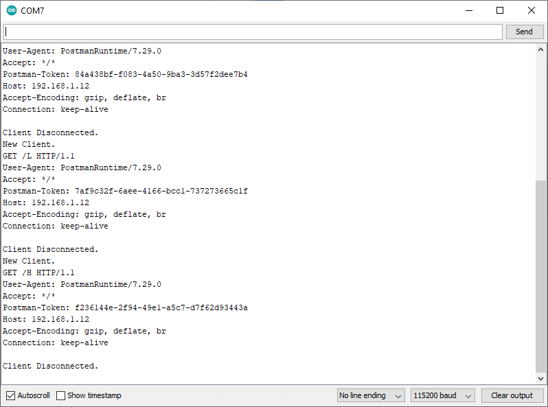

# Ejemplo 2 

:bug:

## Hardware necesario

1. NODEMCU-ESP32
2. Grove - Rotary Angle Sensor ([link](https://wiki.seeedstudio.com/Grove-Rotary_Angle_Sensor/)) 
3. Grove - Red LED ([link](https://wiki.seeedstudio.com/Grove-Red_LED/))
4. Grove - Button ([link](https://wiki.seeedstudio.com/Grove-Button/))


## Descripción

El codigo que se muestra a continuación hace que un NodeMCU funcione como Access Point inalambrico y un servidor Web. Este ejemplo es el [Example 3: Access Point (AP) Web Server](https://learn.sparkfun.com/tutorials/esp8266-thing-development-board-hookup-guide/example-sketch-web-server) tomado del tutorial de Sparkfun [ESP8266 Thing Development Board Hookup Guide](https://learn.sparkfun.com/tutorials/esp8266-thing-development-board-hookup-guide/introduction). Sin embargo, para este caso se hicieron las siguientes adaptaciones:
1. La placa para la cual se implemento fue para la NodeMCU-ESP32S.
2. Esta placa se puso a funcionar como estacion (**STA**).
3. Se hicieron las modificaciones necesarias para la conexión de algunos de los elementos externos.

## Codigo

El código fue tomado del siguiente [link]( https://learn.sparkfun.com/tutorials/esp32-thing-hookup-guide#arduino-example-wifi) y adaptado tal y como se describe a contitnuación:

* **Puertos de proposito general (GPIO)**:

|Pin|GPIO|Variable|Valor|Elemento conectado|
|---|---|---|---|---|
|P5|```GPIO5```|```LED_PIN```|```5```|Grove - Red LED|
|P17|```GPIO17```|```BUTTON_PIN```|```17```|Grove - Button|
|P17|```GPIO15```|```BUTTON_PIN```|```17```|Grove - Button|

* **Configuración WIFi**:

|Variable|Valor|
|---|---|
|```networkName```|```"invitado-udea"```|
|```networkPswd```|```""```|

A continuación se muestra el codigo original, su tarea consistira en codificarlo en el Arduino IDE y modificarlo segun la información anteriormente mostrada:

```ino
#include <WiFi.h>
#include <WiFiClient.h>

//////////////////////
// WiFi Definitions //
//////////////////////
// Set these to your desired credentials.
const char *ssid = "yourAP";
const char *password = "yourPassword";

/////////////////////
// Pin Definitions //
/////////////////////
const int LED_PIN = 5; // LED (GPIO5)
const int ANALOG_PIN = 15; // Analog pin (GPIO15)
const int DIGITAL_PIN = 17; // Digital pin (GPIO17)

WiFiServer server(80);

void setup() 
{
  initHardware();
  setupWiFi();
  server.begin();
}

void loop() 
{
  // Check if a client has connected
  WiFiClient client = server.available();
  if (!client) {
    return;
  }

  // Read the first line of the request
  String req = client.readStringUntil('\r');
  Serial.println(req);
  client.flush();

  // Match the request
  int val = -1; // We'll use 'val' to keep track of both the
                // request type (read/set) and value if set.
  if (req.indexOf("/led/0") != -1)
    val = 1; // Will write LED high
  else if (req.indexOf("/led/1") != -1)
    val = 0; // Will write LED low
  else if (req.indexOf("/read") != -1)
    val = -2; // Will print pin reads
  // Otherwise request will be invalid. We'll say as much in HTML

  // Set GPIO5 according to the request
  if (val >= 0)
    digitalWrite(LED_PIN, val);

  client.flush();

  // Prepare the response. Start with the common header:
  String s = "HTTP/1.1 200 OK\r\n";
  s += "Content-Type: text/html\r\n\r\n";
  s += "<!DOCTYPE HTML>\r\n<html>\r\n";

  /*Note: Uncomment the line below to refresh automatically
   *      for every 1 second. This is not ideal for large pages 
   *      but for a simple read out, it is useful for monitoring 
   *      your sensors and I/O pins. To adjust the fresh rate, 
   *      adjust the value for content. For 30 seconds, simply 
   *      change the value to 30.*/
  //s += "<meta http-equiv='refresh' content='1'/>\r\n";//auto refresh page

  // If we're setting the LED, print out a message saying we did
  if (val >= 0)
  {
    s += "LED is now ";
    s += (val)?"off":"on";
  }
  else if (val == -2)
  { // If we're reading pins, print out those values:
    s += "Analog Pin = ";
    s += String(analogRead(ANALOG_PIN));
    s += "<br>"; // Go to the next line.
    s += "Digital Pin 12 = ";
    s += String(digitalRead(DIGITAL_PIN));
  }
  else
  {
    s += "Invalid Request.<br> Try /led/1, /led/0, or /read.";
  }
  s += "</html>\n";

  // Send the response to the client
  client.print(s);
  delay(1);
  Serial.println("Client disonnected");

  // The client will actually be disconnected 
  // when the function returns and 'client' object is detroyed
}

void setupWiFi()
{
  // Connect to Wi-Fi network with SSID and password
  WiFi.begin(ssid, password);
  while (WiFi.status() != WL_CONNECTED) {
    delay(500);
    Serial.print(".");
  }

  IPAddress serverIP = WiFi.localIP();
  Serial.print("Server IP address: ");
  Serial.println(serverIP);
  server.begin();

  Serial.println("Server started");
}

void initHardware()
{
  Serial.begin(115200);
  pinMode(DIGITAL_PIN, INPUT);
  pinMode(LED_PIN, OUTPUT);
  digitalWrite(LED_PIN, HIGH);
  // Don't need to set ANALOG_PIN as input, 
  // that's all it can be.
}

```

## Diagrama de conexión

A continuación se muestra el diagrama de conexión entre la placa y los componentes externos, la conexión esta hecha de acuerdo a la siguiente tabla:

|Pin|GPIO|Elemento conectado|
|---|---|---|
|P5|```GPIO5```|Grove - Red LED|
|P17|```GPIO17```|Grove - Button|


## Puesta en marcha

Para poner a funcionar el código anterior, realizar las siguientes acciones:
1. Realizar las conexiones propuestas en el diagrama de conexion.
2. Conectar la placa NodeMCU-ESP32 y configurar el IDE para que esta sea la tarjeta a usar.
3. Codificar el codigo anteriormente suministrado.
4. Modificar el código de acuerdo a las instrucciones anteriormente dadas.
5. Descargar el código en la placa.
6. Abrir el monitor serial a ```115200``` pbs y probar el programa y averiguar como funciona. Si todo esta bien el programa funcionara de la siguiente manera:
   *  Salida tras la conexión de la placa al AP de la red:

    

   *  Salida tras presionar el boton:
  
    

## Enlaces

* Los componentes fritzing pueden ser descargados y luego importados del siguiente [link](https://github.com/GabrielNotman/SODAQ_Fritzing/tree/master/Fritzing%20Parts)