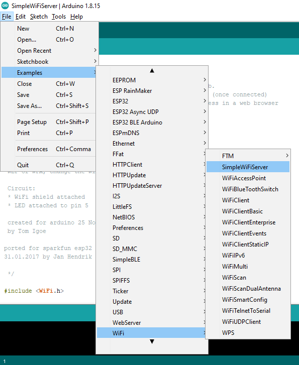

# Ejemplo 2

## Lista de partes

1. NodeMCU-ESP32S

## Descripción

En este ejemplo se pone a funcionar un servidor sencillo en el ESP32 con el objetivo de prender y apagar un led conectado desde un navegador web.

El ejemplo se encuentra dentro se los que vienen con el IDE de Arduino (una vez se han instalado los plugings correspondientes al ESP32). Este ejemplo es **SimpleWiFiServer**; para acceder siga la siguiente ruta: **Examples > WiFi > SimpleWiFiServer** tal y como se muestra en la siguiente imagen:



## Código

```ino
/*
 WiFi Web Server LED Blink

 A simple web server that lets you blink an LED via the web.
 This sketch will print the IP address of your WiFi Shield (once connected)
 to the Serial monitor. From there, you can open that address in a web browser
 to turn on and off the LED on pin 5.

 If the IP address of your shield is yourAddress:
 http://yourAddress/H turns the LED on
 http://yourAddress/L turns it off

 This example is written for a network using WPA encryption. For
 WEP or WPA, change the Wifi.begin() call accordingly.

 Circuit:
 * WiFi shield attached
 * LED attached to pin 5

 created for arduino 25 Nov 2012
 by Tom Igoe

ported for sparkfun esp32 
31.01.2017 by Jan Hendrik Berlin
 
 */

#include <WiFi.h>

const char* ssid     = "yourssid";
const char* password = "yourpasswd";

WiFiServer server(80);

void setup()
{
    Serial.begin(115200);
    pinMode(5, OUTPUT);      // set the LED pin mode

    delay(10);

    // We start by connecting to a WiFi network

    Serial.println();
    Serial.println();
    Serial.print("Connecting to ");
    Serial.println(ssid);

    WiFi.begin(ssid, password);

    while (WiFi.status() != WL_CONNECTED) {
        delay(500);
        Serial.print(".");
    }

    Serial.println("");
    Serial.println("WiFi connected.");
    Serial.println("IP address: ");
    Serial.println(WiFi.localIP());
    
    server.begin();

}

int value = 0;

void loop(){
 WiFiClient client = server.available();   // listen for incoming clients

  if (client) {                             // if you get a client,
    Serial.println("New Client.");           // print a message out the serial port
    String currentLine = "";                // make a String to hold incoming data from the client
    while (client.connected()) {            // loop while the client's connected
      if (client.available()) {             // if there's bytes to read from the client,
        char c = client.read();             // read a byte, then
        Serial.write(c);                    // print it out the serial monitor
        if (c == '\n') {                    // if the byte is a newline character

          // if the current line is blank, you got two newline characters in a row.
          // that's the end of the client HTTP request, so send a response:
          if (currentLine.length() == 0) {
            // HTTP headers always start with a response code (e.g. HTTP/1.1 200 OK)
            // and a content-type so the client knows what's coming, then a blank line:
            client.println("HTTP/1.1 200 OK");
            client.println("Content-type:text/html");
            client.println();

            // the content of the HTTP response follows the header:
            client.print("Click <a href=\"/H\">here</a> to turn the LED on pin 5 on.<br>");
            client.print("Click <a href=\"/L\">here</a> to turn the LED on pin 5 off.<br>");

            // The HTTP response ends with another blank line:
            client.println();
            // break out of the while loop:
            break;
          } else {    // if you got a newline, then clear currentLine:
            currentLine = "";
          }
        } else if (c != '\r') {  // if you got anything else but a carriage return character,
          currentLine += c;      // add it to the end of the currentLine
        }

        // Check to see if the client request was "GET /H" or "GET /L":
        if (currentLine.endsWith("GET /H")) {
          digitalWrite(5, HIGH);               // GET /H turns the LED on
        }
        if (currentLine.endsWith("GET /L")) {
          digitalWrite(5, LOW);                // GET /L turns the LED off
        }
      }
    }
    // close the connection:
    client.stop();
    Serial.println("Client Disconnected.");
  }
}
```

## Puesta en marcha

1. Antes de descargar el código a la tarjeta  configure los parametros de Red cambiando los valores de las variables ```ssid``` y ```password``` a los parametros de la red WiFi a la cual va a conectarse la tarjeta. 
2. Descargue el código.
3. Abriendo la consola serial, reinicie la placa y observe la salida en el monitor serial tal y como se muestra en la siguiente figura (apunte la IP de la placa):


4. Una vez que se haya conectado puede usar el comando ping para verificar conectividad con el Access Point (AP), para ello desde una terminal ejecute el comando:

```bash
ping IP_ESP32
```

Donde **IP_ESP32** es la IP que se le asigno a su placa **NODEMCU-ESP32S**, que para el caso del ESP32 es **192.168.1.12**


5. Siguiendo las instrucciones (las cuales aparecen e) puede en los comentarios del código puede proceder a probar la aplicación desde su navegador favorito:


Si todo esta bien, será posible apagar y prender el led integrado en la tarjeta desde el navegador.

### Opcional

Adicionalmente, se pueden hacer las mismas pruebas con **postman**, a continuación se muestran los resultados al enviar las peticiones para encender y apagar el led:

* **Encendido del led**:


* **Apagado del led**:


## Enlaces 

* https://github.com/paulocsanz?tab=repositories
* https://github.com/me-no-dev?tab=repositories
* https://github.com/espressif/arduino-esp32/blob/master/libraries/WiFi/examples/WiFiAccessPoint/WiFiAccessPoint.ino
* https://github.com/hideakitai?tab=repositories
* https://help.ubidots.com/en/articles/748067-connect-an-esp32-devkitc-to-ubidots-over-mqtt
* https://help.ubidots.com/en/articles/4855281-connect-your-esp32-to-ubidots-over-http-tcp-or-udp
