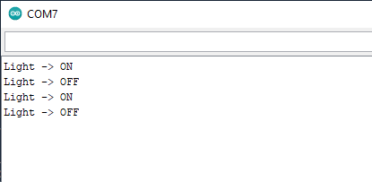

# Ejemplo de una implementacion por pasos

El objetivo de esta sesión es explicar paso a paso como se construye una aplicación sencilla que conecta la placa de desarrollo con una aplicación a la medida que corre desde un PC o una tarjeta RPi. Para este caso, el desarrollo se hizo en un PC.

## Enunciado de la aplicación

Desarrolle una aplicación que permita encender y apagar un Led para el siguiente hardware:

La aplicación se conectara mediante el serial enviando dos comandos basicos para modificar el estado del led:
* **H**: Comando empleado para encender el Led.
* **L**: Comando empleado para apagar el Led.

El resultado final (si todo sale bien) de la aplicación de control es el siguiente:

## Pasos seguidos

El proceso de construcción de la aplicación se lleva a cabo mediante los siguientes pasos:
1. Desarrollo de la aplicación en la herramienta ([link](paso1/README.md)).

   
2. Desarrollo de la aplicación en python (Texto) ([link](paso2/README.md))

   
3. Desarrollo de la aplicación en python (Interfaz grafica) ([link](paso2/README.md))
    
    

## REferencias

* http://downonearthtutorials.blogspot.com/2014/09/real-time-serial-data-monitor-with.html
