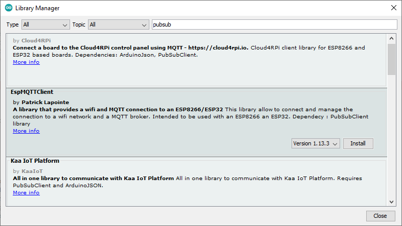
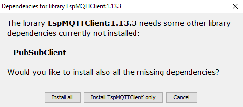
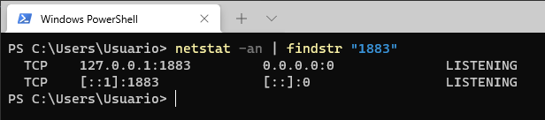

# Paso 1 - Implentacion del programa en la plataforma


## Requisitos previos

Antes de empezar debe instalar las librerias para poder conectar los microcontroladores ESP8266/ESP32 usando MQTT ([EspMQTTClient](https://www.arduino.cc/reference/en/libraries/espmqttclient/)), el repositorio de esta libreria se encuentra en el siguiente [link](https://github.com/plapointe6/EspMQTTClient).

Para llevar a cabo la instalación de esta libreria se siguen los siguientes pasos (ver: **Installing an Arduino Library** ([link](https://learn.sparkfun.com/tutorials/installing-an-arduino-library/all#using-the-arduino-library-manager))):
1. Abra el administrador de librerias: **Sketch -> Include Library -> Manage Libraries... ->**
2. Digite en el campo de busqueda la palabra clave **pubsub**, seleccione la libreria **EspMQTTClient** e instalela:
   
   

3. Como esta libreria depende se otras dependencias, acepte la opcion que permite la instalación de todas las librerias (**Install All**) incluyendo las dependencias:
   
   

## Hardware

### Lista de componentes

|Elemento|Descripcion|
|--|--|
|1|Placa de desarrollo ESP32|
|2|Led|
|3|Resistencia de 330 Ohm|

### Conexion

A continuación se muestra el diagrama de conexión. El led se conecta al puerto P26 (GPIO26) de la tarjeta como se muestra a continuación:


Notese que respecto a la implementación de hardware (componentes y conexión) no cambia para nada.

## Sofware

En este caso, la finalidad del programa será la misma (prender y apagar un led); lo que cambia es la forma como se hace pues para el caso ya no será por medio del envio de comandos mediante comunicación serial, sino que los comandos seran enviados inalambricamente empleando el protocolo MQTT.

De este modo, antes de escribir el programa es necesario tener claro los topicos y los comandos (mensaje) asociados al protocolo MQTT. Estos se resumen en la siguiente tabla.

|Type|Topic|Messaje|
|---|---|---|
|Subscriber|```room/light```| <ul><li>```on``` : Comando que al ser recibido enciende el led led</li><li>```off``` : Comando empleado para apagar el led</li></ul> |
|Publisher|```room/light/state```| <ul><li>```on``` : Mensaje que indica que el led conectado al ESP esta encendido</li><li>```off``` : Indicador de que el led conectado al ESP esta apagado </li></ul> |

Para saber un poco mas sobre como implementar en el ESP32 el protocolo MQTT se recomienda que estudie el siguiente [link](https://learn.sparkfun.com/tutorials/using-home-assistant-to-expand-your-home-automations/introduction) alli se presenta codigo para el ESP32 (ver **MQTT_Light_Example.ino** em el siguiente [link](https://learn.sparkfun.com/tutorials/using-home-assistant-to-expand-your-home-automations/example-1-mqtt--esp32)) que adaptado para nuestro objetivo a nuestro ejemplo:

Basicamente la parte que se tiene que implementar es la siguiente:

* **Configuración de la red wifi**:
  
  |Variable| Valor|Observaciones|
  |---|---|---|
  |```*ssid```|```"WIFI_LIS"```|Nombre del Access Point a la que se conectara el ESP32|
  |```*password```|""|Passoword del Access Point al que se conectara el ESP32|

* **Configuración de la red MQTT**:
  
|Variable|Valor|Observaciones|
|---|---|---|
|```broker(192,168,1,-)```|```broker(192,168,1,4)```|Dirección IP del equipo (RPi o computador) donde esta el broker. En este caso se supuso que el broker estaba en la maquina con IP ```192.168.1.4```. Para saber la IP de la maquina en la cual esta el broker use en esta el comando ```ifconfig```|
|```*ID```|```light_01```|Identificador de la **cosa** en la red|
|```LIGHT_PIN```|```26```|Pin al que se conectara la luz, recuerde que este depende de la conexión fisica del hardware|
|```*TOPIC```|```room/light```|Topico empleado para prender y apagar la luz mediante los comandos ```"on"``` y ```"off"```|
|```*STATE_TOPIC```|```room/light/state```|Topico empleado para conocer el estado de la luz|

A continuación se muestra la porción del codigo adaptada con los valores de las tablas anteriores:

```ino
#include <WiFi.h>
#include <PubSubClient.h>

// WiFi Network Credentials
const char *ssid = "WIFI-LIS";   // name of your WiFi network
const char *password = ""; // password of the WiFi network

// MQTT Network
IPAddress broker(192,168,1,4); // IP address of your MQTT broker eg. 192.168.1.50
const byte LIGHT_PIN = 13;           // Pin to control the light with
const char *ID = "light_01";  // Name of our device, must be unique
const char *TOPIC = "room/light";  // Topic to subcribe to
const char *STATE_TOPIC = "room/light/state";  // Topic to publish the light state to
```

Finalmente, el codigo completo se muestra a continuación (notese que es el código descargado de la pagina original con modificaciones menores):

```ino
#include <WiFi.h>
#include <PubSubClient.h>

// WiFi Network Credentials
const char *ssid = "-----";   // name of your WiFi network
const char *password = "-----"; // password of the WiFi network

// MQTT Network
IPAddress broker(192,168,1,-); // IP address of your MQTT broker eg. 192.168.1.50
const byte LIGHT_PIN = 13;           // Pin to control the light with
const char *ID = "light_01";  // Name of our device, must be unique
const char *TOPIC = "room/light";  // Topic to subcribe to
const char *STATE_TOPIC = "room/light/state";  // Topic to publish the light state to

WiFiClient wclient;

PubSubClient client(wclient); // Setup MQTT client

// Handle incomming messages from the broker
void callback(char* topic, byte* payload, unsigned int length) {
  String response;

  for (int i = 0; i < length; i++) {
    response += (char)payload[i];
  }
  Serial.print("Message arrived [");
  Serial.print(topic);
  Serial.print("] ");
  Serial.println(response);
  if(response == "on")  // Turn the light on
  {
    digitalWrite(LIGHT_PIN, HIGH);
    client.publish(STATE_TOPIC,"on");
  }
  else if(response == "off")  // Turn the light off
  {
    digitalWrite(LIGHT_PIN, LOW);
    client.publish(STATE_TOPIC,"off");
  }
}

// Connect to WiFi network
void setup_wifi() {
  Serial.print("\nConnecting to ");
  Serial.println(ssid);

  WiFi.begin(ssid, password); // Connect to network

  while (WiFi.status() != WL_CONNECTED) { // Wait for connection
    delay(500);
    Serial.print(".");
  }

  Serial.println();
  Serial.println("WiFi connected");
  Serial.print("IP address: ");
  Serial.println(WiFi.localIP());
}

// Reconnect to client
void reconnect() {
  // Loop until we're reconnected
  while (!client.connected()) {
    Serial.print("Attempting MQTT connection...");
    // Attempt to connect
    if(client.connect(ID,HA_USER,HA_PASS)) {
      client.subscribe(TOPIC);
      Serial.println("connected");
      Serial.print("Subcribed to: ");
      Serial.println(TOPIC);
      Serial.println('\n');

    } else {
      Serial.println(" try again in 5 seconds");
      // Wait 5 seconds before retrying
      delay(5000);
    }
  }
}

void setup() {
  Serial.begin(115200); // Start serial communication at 115200 baud
  pinMode(LIGHT_PIN, OUTPUT); // Configure LIGHT_PIN as an output
  delay(100);
  setup_wifi(); // Connect to network
  client.setServer(broker, 1883);
  client.setCallback(callback);// Initialize the callback routine
}

void loop() {
  if (!client.connected())  // Reconnect if connection is lost
  {
    reconnect();
  }
  client.loop();
}
```

Por ahora no se preocupe por entender la logica de la aplicación pues esto se vera con mas detalle cuando se trate con profundidad el tema de **MQTT** El siguiente paso consiste en probar el correcto funcionamiento de la aplicación.

## Prueba

Pasos

1. Verificar que el broker esta corriendose. En el caso de linux usar:

```bash
sudo netstat -tanlp | grep 1883
```

Para Windows usar:

```cmd
netstat -an | findstr "1883"
```

En nuestro caso (teniamos una maquina con windows) y el resultado se muestra a continuación:




Para ver que el mosquito esta bien puede ademas usar el comando:

```bash
mosquitto -v
```

Antes de proseguir al registro de los topicos, se recomienda que ejecute el comando de ayuda del mosquito y observe brevemente las opciones a usar:

```bash
mosquitto -h
```

2. Inicialmente vamos a usar el **mosquito** probar los topicos definidos en la tabla inicial:

* **Terminales que simulan el ESP32**:

|Terminal|Type|Topic|Comando en mosquito|Observaciones|
|---|---|---|---|---|
|1|Subscriber|```room/light```|```mosquitto_sub -h 127.0.0.1 -t "room/light"```|Terminal que simulara los comandos recibidos por el ESP32|
|2|Publisher|```room/light/status```|<ul><li>**Led on**: <br> ```mosquitto_pub -h 127.0.0.1 -t "room/light/status" -m "on"``` </li>**Led off**: <br> ```mosquitto_pub -h 127.0.0.1 -t "room/light/status" -m "off"``` </li>|Terminal que simulara los comandos que envia el ESP32 para indicar el estado de las luces|

* **Terminales que simulan la aplicación de escritorio**:

|Terminal|Type|Topic|Comando en mosquito|Observaciones|
|---|---|---|---|---|
|3|Subscriber|```room/light/status```|```mosquitto_sub -h 127.0.0.1 -t "room/light/status"```|Terminal que simulara los comandos recibidos por la aplicación de escritorio (recibidos desde el publisher del ESP32)| 
|4|Publisher|```room/light/```|<ul><li>**Led on**: <br> ```mosquitto_pub -h 127.0.0.1 -t "room/light" -m "on"``` </li><li>**Led off**: <br> ```mosquitto_pub -h 127.0.0.1 -t "room/light" -m "on``` </li></ul>| Terminal que simulara los comandos de control enviados desde la aplicación de escritorio para controlar el ESP32|


Descargue el programa y abra la terminal serial a 9600 bps, luego pruebe enviando caracteres ```'H'``` (prender luz) y ```'L'``` a traves de esta. Si todo sale bien, se deberá prender y apagar el led conectado a esta. La siguiente figura muestra la salida en el monitor serial:


Cuando la prueba resulte exitosa, vaya al paso 2 ([link](../paso2/README.md)).

